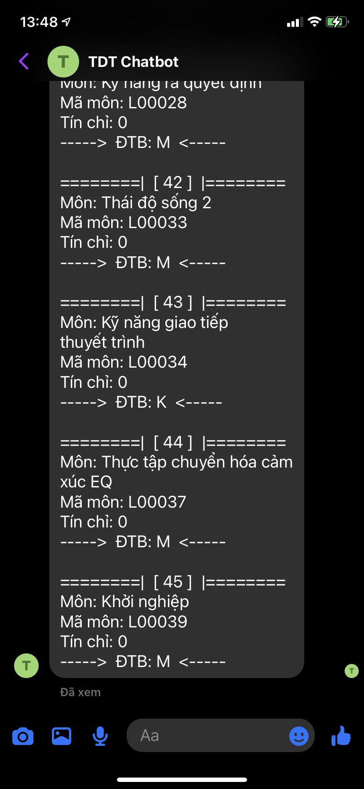
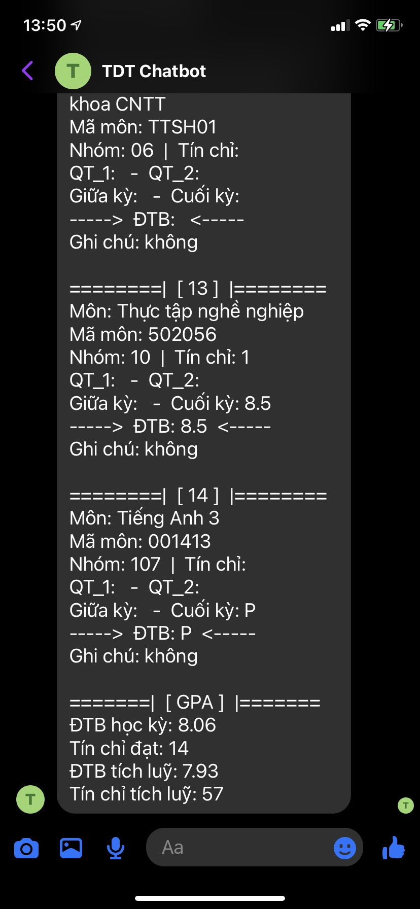

# TDT Chatbot
This project is a Facebook chatbot which replies to predefined messages. 

It first scrapes data from Student Portal and then sends them to user through a Facebook page.

The page has been turned off for private use only. So sadly you can't find it!

## Purpose
The main purpose is to practice scraping and make a Facebook chatbot. There is no harmful intention to Student Portal.

## Tool used
- request-promise 
- cheerio 
- express
- ejs

## Screenshots

Login                        | Help&nbsp;                  | Week                        | Week next                        | Today
---------------------------- | --------------------------- | --------------------------- | -------------------------------- | ------------------------------
 |  |  |  | 

Score                        | Score all                        | Score all                        | Score -&nbsp;                       | Score -&nbsp;
---------------------------- | -------------------------------- | -------------------------------- | ----------------------------------- | -----------------------------------
 |  |  |  | 
