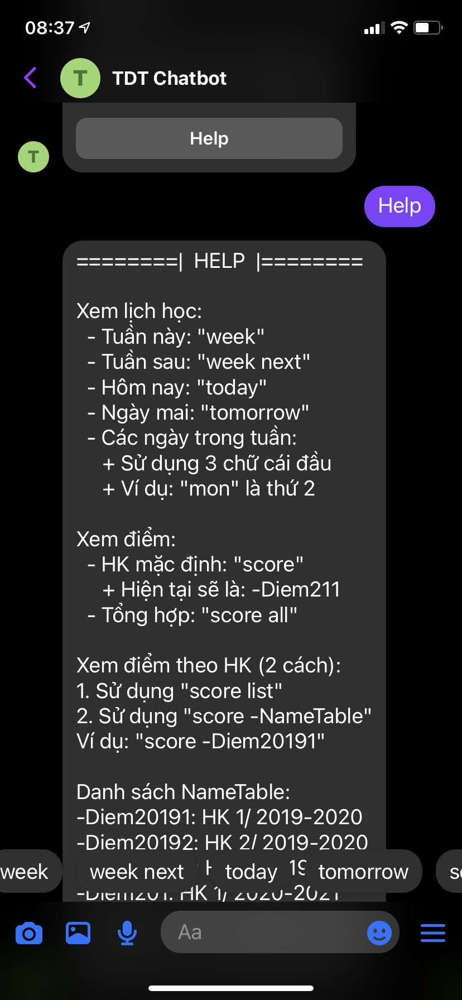
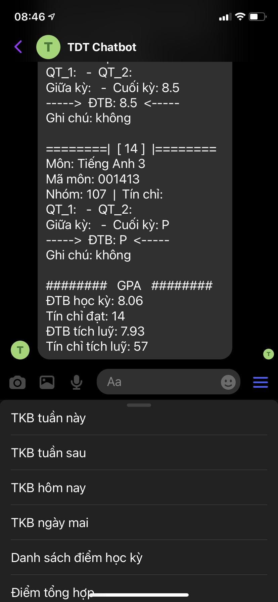
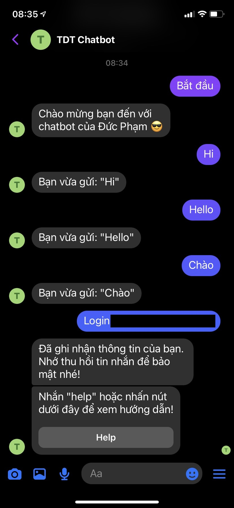
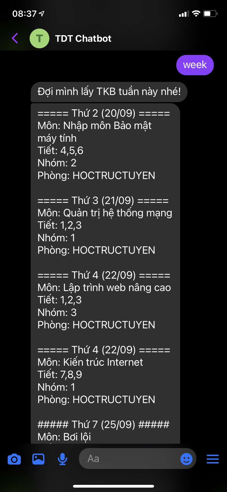
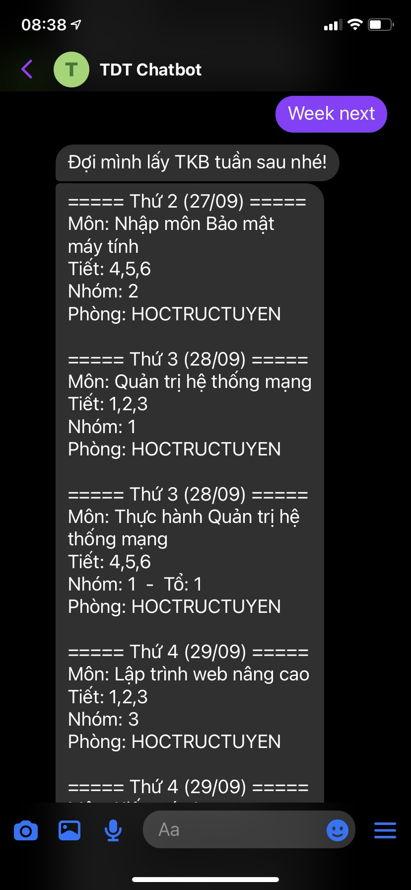
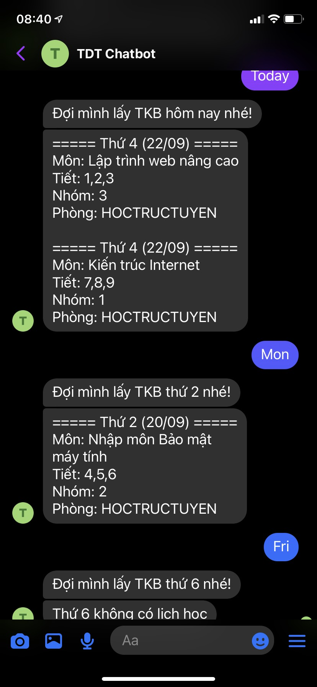
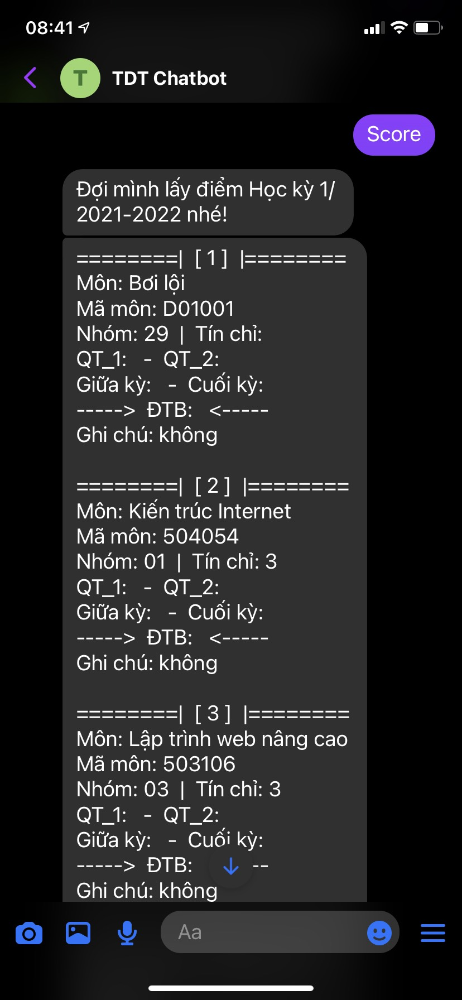
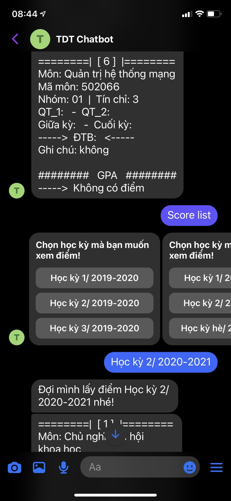
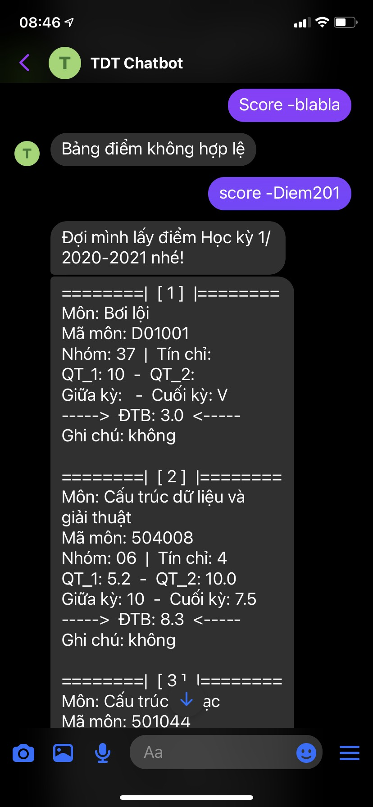

# TDT Chatbot

This project is a Facebook chatbot that sends schedule and score scraped from TDTU Student Portal.

## Getting started

- Follow this guide: [https://developers.facebook.com/docs/messenger-platform/getting-started](https://developers.facebook.com/docs/messenger-platform/getting-started)

- Create a `.env` file

```
PAGE_ACCESS_TOKEN=
VERIFY_TOKEN=
MSSV=
PASS=
```

- To run app in production

```bash
$ yarn build
$ yarn start
```

- To run app in development

```bash
$ yarn dev
```

_Always set up Semester in `http://localhost:5000/setting` when your server starts._

## Why did I do this project?

The main purpose is to practice scraping and make a Facebook chatbot. 

This app also makes my student life more convenient.

## Screenshots

Click on the image to view full size.

| Help                                             | Menu                                              |
| ------------------------------------------------ | ------------------------------------------------- |
|  |  |

| Login                          | Week                          | Week next                          | Today                            |
| ------------------------------ | ----------------------------- | ---------------------------------- | -------------------------------- |
|  |  |  |  |

| Score                          | Score overall                      | Score list                          | Score -                               |
| ------------------------------ | ---------------------------------- | ----------------------------------- | ------------------------------------- |
|  |  |  |  |
