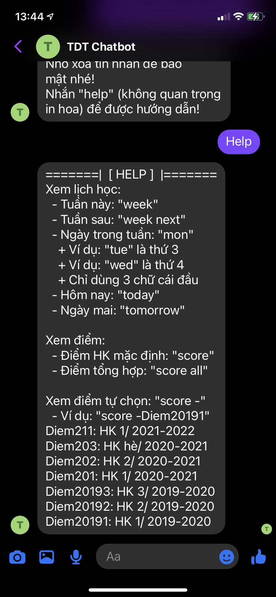
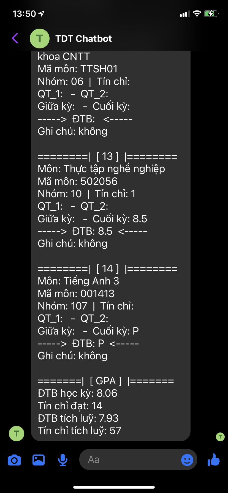
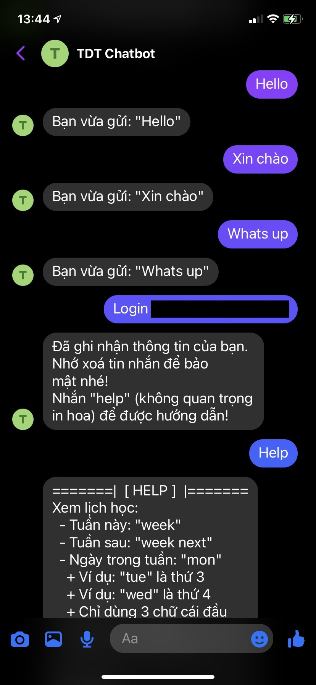
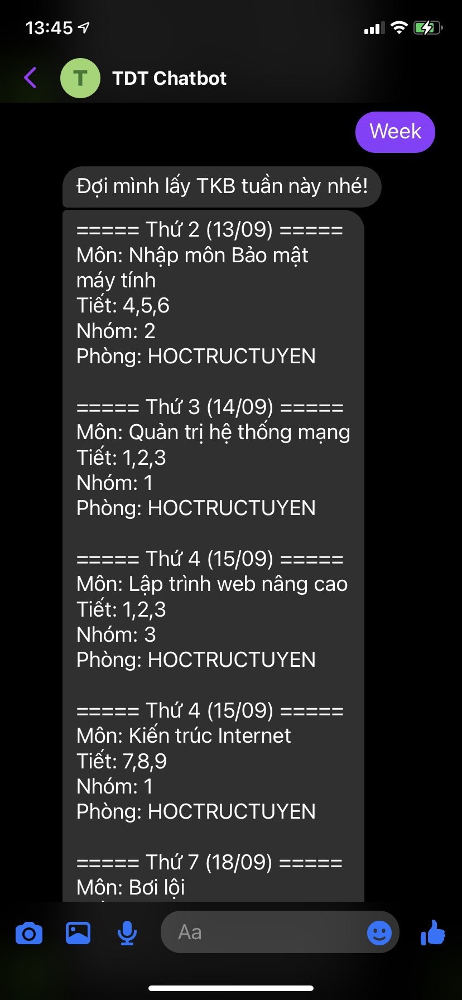
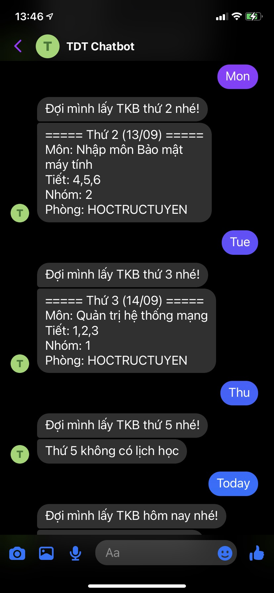
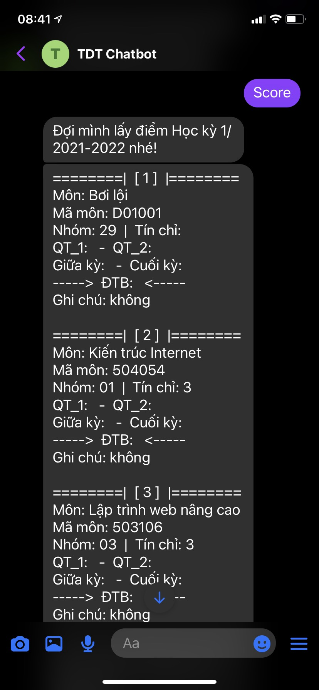
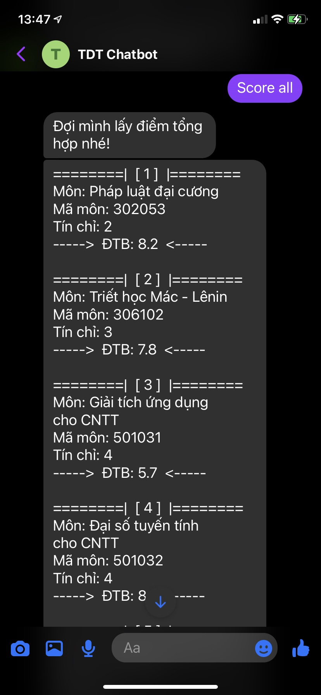
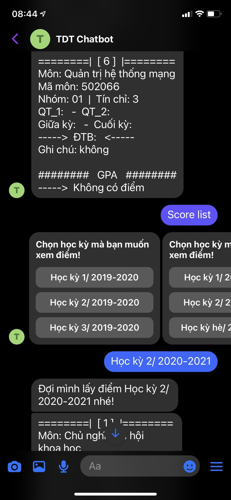
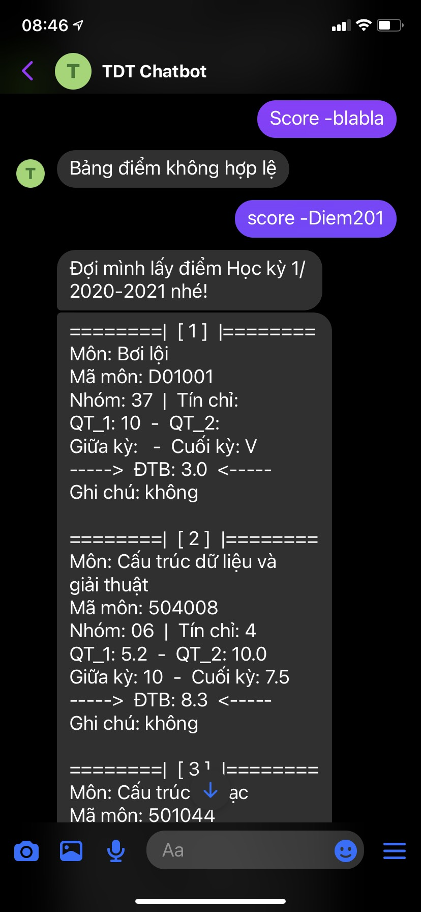

# TDT Chatbot
This project is a Facebook chatbot that sends schedule and score scraped from TDTU Student Portal.

*Please remember to use it responsibly.*

## Getting started
Check [the screenshots below](#screenshots), especially **Help** and **Menu**.

- Create a `.env`
```
PAGE_ACCESS_TOKEN=
VERIFY_TOKEN=
MSSV=
PASS=
```
- Follow this guide: [https://developers.facebook.com/docs/messenger-platform/getting-started](https://developers.facebook.com/docs/messenger-platform/getting-started)
- Make sure to set up Semester in `http://localhost:5000/setting` on your first run.

## Why did I do this project?
The main purpose is to practice scraping and make a Facebook chatbot. This app also makes my student life more convenient.

There is no harmful intention to TDTU Student Portal.

## Tool used
`Node v14.16.0` and `Npm v7.24.1`, worth mentioning:
- request-promise 
- cheerio 
- express
- ejs

## Screenshots
Click on the image to view full size.

Help                                           | Menu                        
---------------------------------------------- | ---------------------------- 
 | 

Login                        | Week                        | Week next                        | Today
---------------------------- | --------------------------- | -------------------------------- | ------------------------------
 |  |  | 

Score                        | Score all                        | Score list                        | Score -                       
---------------------------- | -------------------------------- | --------------------------------- | ----------------------------------- 
 |  |  |  
